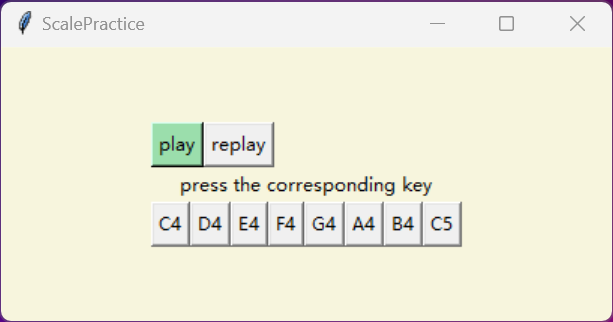

# Major_scale_practice
基于tkinter的听音练习app | An easy tkinter based app for major scale practice  

## Features
- 交互的听音练习 | Interactive scale practice
- 正确反馈 | Visual feedback for note correctness
- From C4 to C5
- Modules: tkinter,pygame

